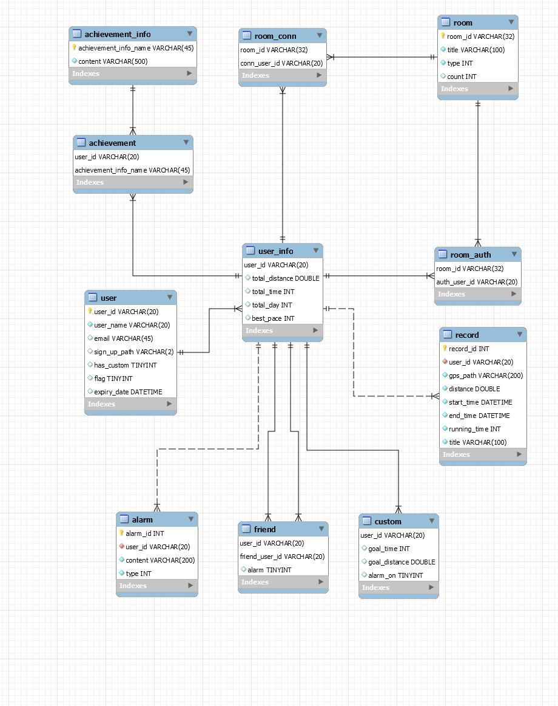
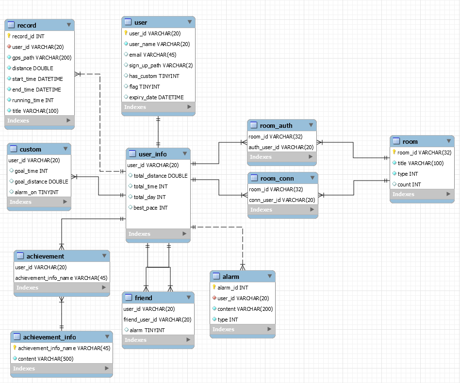

# Daily Report 

## 2021.04.15. 아이디어 회의 마무리

> 드디어 아이디어가 1개로 추려졌다.

### 오전 

> 지금까지 나온 아이디어 4개로 추리기

- 달리기 앱 : 런데이와 비슷하지만 공존과 경쟁 기능
- 알약 : 본인이 보유하고 있는 약 관리
- 에코+용기내 : 용기내 운동을 메인으로 한 환경 보호 앱
- 잇페메 : IT 관련 공부 및 면접 앱

### 오후

> 최종 결정 완료

- 달리기 앱으로 결정 됐으니 기능 구체화 및 기능에 필요한 기술 정리 + 공부

## 2021.04.16. 기능 구체화

### 오전

> 필요 기능과 구현을 위해 필요한 기술 상세 명시

| 기능       | 상세                                   | 내용                                                         |
| ---------- | -------------------------------------- | ------------------------------------------------------------ |
| 회원관리   | 소셜로그인                             | 카카오 or 네이버                                             |
|            | 일반로그인                             | 메일 + 비번                                                  |
|            | 회원가입                               | 이메일+비밀번호+닉네임+프사? 가입시 코드 부여           |
|            | 정보 수정                              | 닉네임+프사?                                                 |
|            | 탈퇴는 없음                            |                                                              |
|            | 친구                                   | 추가, 삭제                                                   |
|            | 러닝 그룹?                             | 소모임 같이 달리기 그룹 생성 만나지 않더라도 시간대 맞추기용 |
| 달리기     | 지도                                   | 내가 지금까지 달린거                                         |
|            | 정보 표기                              | 평균 속력, 거리, 시간                                        |
|            | 중도 포기 가능                         |                                                              |
| 함께달리기 | 바로 매칭                              | 지금 달리고 있는 사람과 자동 매치 바로 매칭을 할지 안할지 회원관리에서 수정 |
|            | 방 만들기                              | 그냥 같이 달리기, 속도 대결, 거리 대결 시간 및 거리 제한 설정 가능 비공개 여부 설정 생성시 방 코드 같이 생성 |
|            | 방 정보 수정                           | 정보 수정                                                    |
|            | 방 목록                                | 생성된 방 중 공개된 방                                       |
|            | 방 코드 입력                           | 어느 방이든 코드 입력해서 입장 가능 비공개방의 경우 비밀번호없이 코드로만 입장 |
|            | 방 삭제                                | 시작 전 삭제 가능 시작 후 나가기 => 모든 멤버가 나가면 삭제 |
| 기록하기   | 사진 찍기                              | 달리기 종료 이후 사진 기록 평균속력, 거리, 시간 워터마크 선택 가능 커스텀 텍스트 입력 가능 |
| 공유하기   | 인스타                                 | 인스타그램 계정 연동으로 공유 가능                           |
|            | 카카오                                 | 내 기록 사진 혹은 데이터 링크 전송                           |
| 랭킹시스템 | 항목별 순위                            |                                                              |
| 배지시스템 | 여러개의 배지 디자인이 좀 필요... | 첫 러닝, 첫 친구, 30분 달성, 1시간 달성, 10시간 달성...      |

[인스타그램으로 공유](https://developers.facebook.com/docs/instagram/sharing-to-feed)

[안드로이드 VoIP](https://developer.android.com/guide/topics/connectivity/sip?hl=ko#manager)

---

## 2021.04.19. 앱 방향성 회의 및 세부 사항 결정

### 방 vs 크루 vs 친구

크루 기능에 대해 열띤 토론을 나눴습니다.

결과적으로 개발 기간에 의한 제약으로 크루 기능은 포기하고 방과 친구기능만 구현하기로 결정했습니다.

추후 기간이 허락한다면 크루 기능도 넣을 생각입니다.

### 목표 설정 vs 바로 시작

달리기 시작시 목표를 설정하고 시작할지 바로 시작할지에 대한 논의가 있었습니다.

목표를 뚜렷하게 정하고 하는 것보단 바로 시작하는 것이 타겟인 라이트 유저에게 적합할 것으로 판단했습니다.

### 컨셉 확정

달리기와 소셜이 결합된 앱으로 방향을 확정했습니다. `함께 달리기`를 구현하기 위해 열심히 해야겠습니다.

---

## 2021.04.20 ERD 구성 및 목업 작업

### 목업 작업 시작

목업 제작 툴은 Adobe XD를 사용하고 있습니다. 화면과 기능에 대한 의견을 완전히 모으는 작업이 따로 필요할 듯 합니다. 

이번 주 내로 안드로이드의 컴포넌트 구현 가능 여부를 파악하고 목업도 완성시켜야겠습니다.

목업은 쉽게 짤 수 있지만 구현 가능성에 대한 생각까지는 아직 못 했습니다.

기간 내 구현 가능성까지 생각하며 목업 구성을 해야겠습니다.

### ERD 구성

다같이 DB 관련 회의 이후 백엔드 담당하시는 분들이 ERD 구성을 마쳤습니다.

---

## 2021.04.21. ERD 수정, API 구성, 목업 작업

### ERD 수정

ERD에 아주 작은 변경사항이 있어서 백엔드 분들이 수정했습니다.

해당 DB로 고정됐습니다.

### API 구성

백엔드에서 API를 구성하고 모두 회의를 거쳐 완성했습니다.

[노션](https://www.notion.so/9766f3bb91be400d83cc6d53ca8162d3?v=493b7759e30d427a81ab55daa7a4cec4)

### 목업 작업

- 혼자 달리기/같이 달리기 각자 구성 후 방향 찾기

---

- 대략적인 방향 및 하단, 상단 메뉴 바 확정

---

## 2021.04.22. 플로우차트, 목업 작성, 발표 준비

### 플로우차트 작성

[링크](https://app.diagrams.net/#G1lL_o4z5IeW8Sqr1sqBmV_SgevC4ghh_f)

플로우차트 작성을 마쳤습니다. 기능이 생각보다 많아져서 약간 걱정이 됩니다.

### 목업 작성

목업 구성을 어느정도 마쳤습니다. 에리얼과 클로이가 큰 역할을 해줬습니다.

### 발표 준비

금요일 발표를 위해 다들 늦게까지 작업했습니다.

---

## 2021.04.23 초기 안드로이드 파일 업로드, 발표

### 안드로이드 파일 업로드

첫 안드로이드 프로젝트를 생성했습니다.

Git에 업로드는 에리얼이 했습니다. Kotlin이나 Jetpack Compose의 기본적인 정보도 없이 프로젝트를 시작하는 것은 위험할 것이라 판단하여 프로젝트 생성 후 바로 업로드를 했습니다.

주말간 공부 이후 어느 수준의 이해도를 가지고 월요일에 프로젝트를 본격 시작하려 합니다.

### 발표

역시는 역시였습니다.

아주 부드럽지만 눈길을 끄는 발표를 클로이가 멋있게 해냈습니다.

다른 팀들의 발표를 보긴 했지만 생각보다 눈에 띄는 프로젝트는 없었습니다.

중간 발표는 항상 기획 발표였던것 같아서 눈에 안띄었을수도 있겠습니다.

앞으로 다른 팀들이 어떻게 개발하는지 지켜봐야겠습니다.

---

## 2021.04.26 상단, 하단 메뉴 바

### 하단 메뉴 바

안드로이드에서 제공하는 NavGraph를 사용해보려했지만 시간 관계상 구현을 우선으로 하는게 나을거라고 판단했습니다. 

BottomNavigationView를 사용해서 Fragment를 전환하는 식으로 구현했습니다.

### 상단 메뉴바

ActionBar를 없애고 비슷한 디자인으로 아직 기능이 없는 알림과 설정 버튼을 구현했습니다.

---

## 2021.04.27 네트워크 클래스 구성

네트워크 클래스 구성 중입니다.

통신 자체는 구현을 했지만 Thread 문제로 완전히 구현은 못했습니다.

---

## 2021.04.28 GET 방식 구현 완료

현재 Parameter를 따로 받지 않고 URL만을 이용한 GET 방식 통신 함수를 구현했습니다.

팀 회의 이후 Parameter를 따로 구성하는게 낫다고 생각해서 함수 변경과 함께, PUT, DELETE, POST 방식의 함수도 구현할 예정입니다.