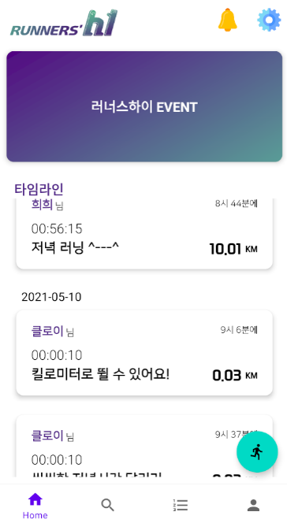
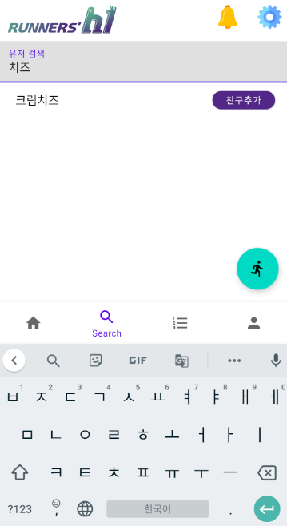
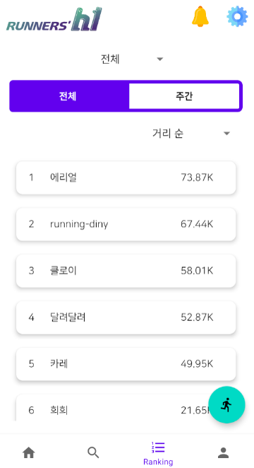
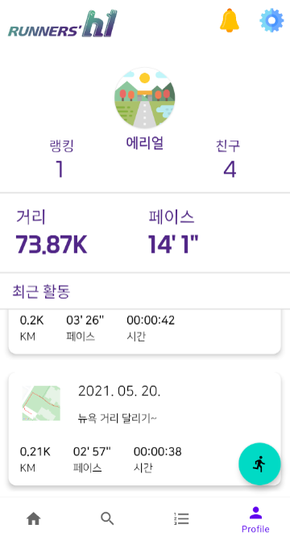
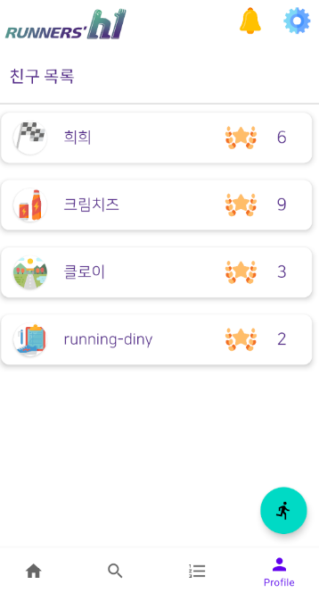
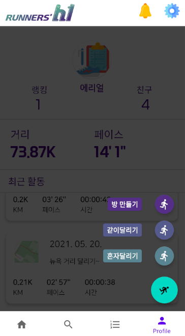
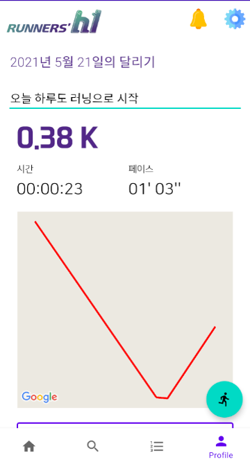
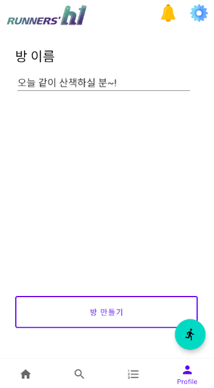
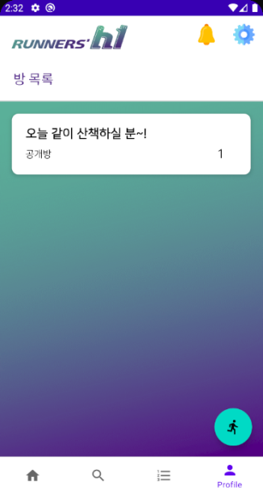
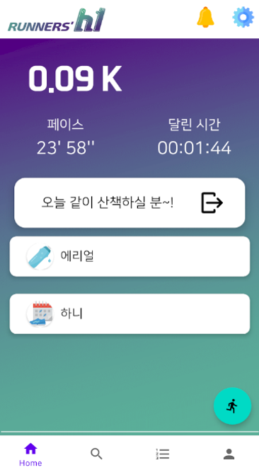

# [A306] Runners' HI 소셜 러닝 앱

:runner: :runner: 따로, 또 같이 달릴 수 있는 소셜 러닝 앱 서비스입니다 :runner: :runner:

 

# :memo: 프로젝트 안내

해당 프로젝트는 Android 를 이용한 어플리케이션입니다.

따라서, 어플 설치 후 테스트 하는 것을 권장합니다.

에뮬레이터로 이용하실 때는 **Pixel API 29 환경**에서 보는 것을 권장해드립니다!

 

## :hammer_and_wrench: ​프로그램 설치

### 안드로이드 

다운받은 apk파일을 폰에서 설치합니다. 

 

## :mag: 페이지 안내

### Sign up & Sign in

1. 일반 회원가입 & 로그인 가능
2. 카카오톡을 이용하 소셜 회원가입 & 로그인 가능

### Home

1. Runners' HI에서 진행하는 이벤트가 올라올 페이지가 보입니다.
2. 내가 친구를 맺은 사람의 달리기 기록 타임라인이 보여집니다.
3. 상단 로고 오른쪽에 친구 알림과 설정이 있습니다.

### Alarm

1. 친구 신청 알림을 받을 수 있습니다.
2. 친구 수락을 누르면 alert 창이 뜨고, 수락 시 친구 목록에 들어옵니다.

### Settings

1. 로그아웃 기능
2. 개인정보 취급 및 조항

### User Search

1. 친구를 검색할 수 있는 화면입니다.
2. 한 글자를 입력할 때 마다 그에 해당하는 유저들의 이름이 보여집니다.
3. 유저 닉네임의 중간을 입력해도 검색이 가능합니다.
4. 친구 추가 버튼을 누르면 친구 추가 request를 보낼 수 있습니다.

### Ranking

1. 전체 유저 / 친구 유저 별 랭킹을 확인할 수 있습니다.
   - 친구 랭킹에서는 내 랭킹이 포함되어 표시되어집니다.

2. 거리, 페이스, 달린 시간 별 랭킹을 그 안에서 나눠 확인할 수 있습니다.

### Profile

1. 프로필 사진은 랜덤으로 바뀌어 유저에게 재미를 주었습니다.

2. 랭킹은 거리별 랭킹을 기준으로 표시되어지고, 랭킹을 누르면 랭킹 페이지로 이동되어집니다.

3. 친구는 내가 친구 맺은 유저 수가 표시되어지고, 친구를 누르면 친구 리스트로 이동되어집니다.

      
      
      
      
      - 친구 리스트에서는 친구의 닉네임과 랭킹을 확인할 수 있습니다.

4. 거리는 지금까지 달린 총 거리가 표시되어지고,  페이스는 베스트 페이스가 표시되어집니다.

5. 최근 활동은 내가 달리고 난 뒤 저장한 혼자 달리기 내역들이 저장되어집니다.
   - 각 항목을 클릭하면, 항목의 상세 페이지로 이동합니다.

### Floating Button

> 모든 화면에서 접근할 수 있는 달리기 버튼

1. [방 만들기](####방 만들기)
2. [같이 달리기](####같이 달리기)
3. [혼자 달리기](####혼자 달리기)

로그인 이후 두 번 클릭으로 각 항목으로 빠르게 이동할 수 있습니다.

#### 혼자 달리기

- 거리, 페이스 시간 그리고 지도 : 딱 필요한 정보만 깔끔하게 기록
- 실시간으로 내 위치가 지도에 표시 되어집니다.
- 달리기를 일시정지 및 다시 달리기를 할 수 있고, 상단 바에서도 해당 기능을 이용할 수 있습니다.
- 종료 버튼을 누르면 저장화면으로 이동됩니다.
  - 저장 화면에서 제목을 입력하지 않고 그대로 저장을 하게 되면, 기본 제목 "yyyy년 MM월 dd일의 달리기"로 저장됩니다.
  - 저장을 할 때 지도 정보가 같이 저장되고, 프로필의 최근 활동 list에 가장 상단에 표시되어집니다.

#### 방 만들기

- 방 이름을 입력하고 방 만들기를 누르면 방이 생성됩니다.
- 내가 만든 방으로 이동되고, 다른 유저가 들어오면 대화가 가능합니다.

#### 같이 달리기

- 유저들이 만든 방 목록이 나옵니다.
- 방의 제목과 현재 몇 명이 들어가 있는지가 표시되어집니다.
- 방을 클릭하면 해당하는 방으로 이동되고, 현재 방에 들어와 있는 유저들과 대화가 가능합니다.

 

## :books: Workspace

`Notion` : https://www.notion.so/A306-Runners-HI-24262b8ef8494fdc99bc3f8ff8e6614b

 

## [🚀 Ground Rule](./Groud Rule.md)

